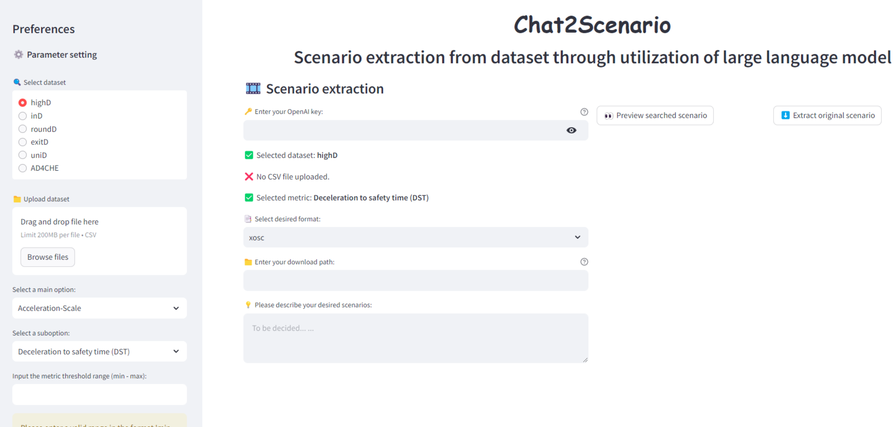

# Chat2Scenario: Scenario Extraction From Dataset Through Utilization of Large Language Model

## 🚨 Important News 🚨

**June 17, 2024**: The web app "chat2scenario" is accessiable via [https://chat2scenario.streamlit.app/](https://chat2scenario.streamlit.app/)

**July 20, 2024**: ASAM OpenSCENARIO 1.0, 1.1, and 1.2 are available. IPG CarMaker text format is deprecated, as CarMaker has been compatible with ASAM OpenSCENARIO since version 13.0,

## Description

Chat2Scenario is a web-based tool that allows users to search for specific driving scenarios within a dataset by inputting descriptive functional scenario text. Results are presented in [ASAM OpenSCENARIO](https://www.asam.net/standards/detail/openscenario/) and [IPG CarMaker .txt](https://ipg-automotive.com/en/support/support-request/faq/usage-of-user-inputs-from-a-file-in-a-maneuver-133/) format. 
For more details of Chat2Scenario implementation, please refer to our paper [here](https://ieeexplore.ieee.org/document/10588843).  
<table>
  <tr>
    <td></td>
    <td></td>
  </tr>
</table>

## Citation
```bibtex
@INPROCEEDINGS{10588843,
  author={Zhao, Yongqi and Xiao, Wenbo and Mihalj, Tomislav and Hu, Jia and Eichberger, Arno},
  booktitle={2024 IEEE Intelligent Vehicles Symposium (IV)}, 
  title={Chat2Scenario: Scenario Extraction From Dataset Through Utilization of Large Language Model}, 
  year={2024},
  volume={},
  number={},
  pages={559-566},
  keywords={Measurement;Intelligent vehicles;Large language models;Natural language processing;Testing;Large Language Model;Scenario Extraction;Automated Driving Systems;Virtual Testing},
  doi={10.1109/IV55156.2024.10588843}}
```

## Usage
### Without installation
- You can directly access the web app via the following link: [https://chat2scenario.streamlit.app/](https://chat2scenario.streamlit.app/)

### With installation
- Follow the installation and operation instructions to download the source code and use it locally.

## Installation
### Pre-requirements
- Python installation
	- This repository is developed under python 3.9.19 in Anaconda.
- Application for dataset
	- The highD dataset can be applied via (https://levelxdata.com/highd-dataset/).
- [OpenAI API key](https://help.openai.com/en/articles/4936850-where-do-i-find-my-api-key) 
### Clone this repository
```bash
git clone https://github.com/ftgTUGraz/Chat2Scenario.git 
```
### Install all required packages
#### Method 1 - in your original environment
```bash
pip install -r requirements.txt
```
#### Method 2 - create a new environment through yml file
```bash
conda env create -f environment.yml
conda activate chat2scenario
```

## Operation
### Method 1 - Web Interface
- Open the Project
    - Open the entire project using a code editor e.g., Visual Studio Code
    - Run the project in the terminal with the following command
    ```bash
    streamlit run .\Chat2Scenario-Web.py
    ```
    - The Chat2Scenario web application will appear

- Set Up Everything
    - Select "highD" dataset option (currently, only highD is compitable).
    - Upload the corresponding dataset (only the xx_tracks.csv file should be uploaded).
    - Select a criticality metric and specify the threshold.
    - Enter your OpenAI API Key.
    - Choose the desired scenario format.
    - Provide a descriptive text for the scenario e.g., "The ego vehicle maintains its lane and velocity. Initially, Target Vehicle #1 is driving in the left adjacent lane. It then accelerates and changes lanes to the right, eventually driving in front of the ego vehicle."
- Run
    - Click "Preview searched scenario" to search for and preview scenarios. 
    - Scenarios are ready for download when the prograss bar reaches 100%.
- Download
    - Click "Extract original scenario" to start extraction process.
    - After the progress bar reaches to 100\%, click "download" to acquire the xosc files. 
- (Optional) Modify the path 
    - If necessary, modify the path of RoadNetWork in the generated OpenSCENARIO.

### Method 2 - Command Line Interface
The project can also be run from the command line using `Chat2Scenario_Script.py`. This method is useful for batch processing or automation.

#### Basic Usage
```bash
python Chat2Scenario_Script.py
```
This will use the default configuration files:
- `config/config.json`: Main configuration file
- `config/config_scenario_descriptions.txt`: Scenario descriptions

#### Command Line Options
```bash
python Chat2Scenario_Script.py [options]

Options:
  --config PATH        Path to configuration file (default: config/config.json)
  --scenarios PATH     Path to scenario descriptions file (default: config/config_scenario_descriptions.txt)
  --track-nums N [N...]  Track numbers to process (overrides config file)
  --openai-key KEY    OpenAI API key (overrides config file)
  --model MODEL       OpenAI model to use (overrides config file)
  --base-url URL      OpenAI API base URL (overrides config file)
  --output-dir DIR    Output directory (overrides config file)
  --max-workers N     Maximum number of worker threads (overrides config file)
```

#### Example
1. Using the default configuration files in the `config` folder:
```bash
python Chat2Scenario_Script.py
```
Attention! Remember to set:
- everything you want to set in the `config.json` file.
- the scenario descriptions in the `config_scenario_descriptions.txt` file.

2. Using a custom configuration file:
```bash
python Chat2Scenario_Script.py --config my_config.json --scenarios my_scenarios.txt
```

3. override configuration by command line
```bash
python Chat2Scenario_Script.py --track-nums 1 2 3 4
```

#### Scenario Descriptions File Format
The scenario descriptions file should contain one scenario per line:
```text
1. The ego vehicle is driving straight in the ego lane, and the target vehicle ahead changes lanes to the left adjacent lane.
2. The ego vehicle is accelerating in the ego lane, and the target vehicle ahead changes lanes to the left adjacent lane.
# Lines starting with # are comments and will be ignored
```

## Contributing
Contributions are what make the open source community such an amazing place to be learn, inspire, and create. Any contributions you make are greatly appreciated.
- Fork the project.
- Create your feature branch (git checkout -b feature/enhancement)
- Commit your changes (git commit -m 'add some enhacement')
- Push to the branch (git push origin feature/enhancement)
- Open a pull request

## Developers

* Yongqi Zhao ([yongqi.zhao@tugraz.at](mailto:yongqizhao@tugraz.at))
* Wenbo Xiao ([wenbo.xiao@student.tugraz.at](mailto:wenbo.xiao@student.tugraz.at))

For help or issues using the code, please create an issue in this repository or contact Yongqi Zhao at [yongqi.zhao@tugraz.at](mailto:yongqi.zhao@tugraz.at), contact Wenbo Xiao at [wenbo.xiao@student.tugraz.at](wenbo.xiao@student.tugraz.at). 
You can also ask questions in our SLACK Workspace. **[Click here(renewed link)!](https://join.slack.com/t/chat2scenario/shared_invite/zt-2hwtat65j-c2EqeGGewDJpWRBpPUhNDw)**

## Acknowledgement
- This work was supported by FFG in the research project PECOP (FFG Projektnummer 893988) in the program "Bilateral Cooperation Austria - People's Republic of China/Most 2nd Call".

- The codebase is built upon other these previous codebases:<br>
	- [Environment Simulator Minimalistic (esmini)](https://github.com/esmini/esmini)<br>
	- [scenariogeneration](https://github.com/pyoscx/scenariogeneration)<br>
	- [streamlit](https://github.com/streamlit/streamlit)
